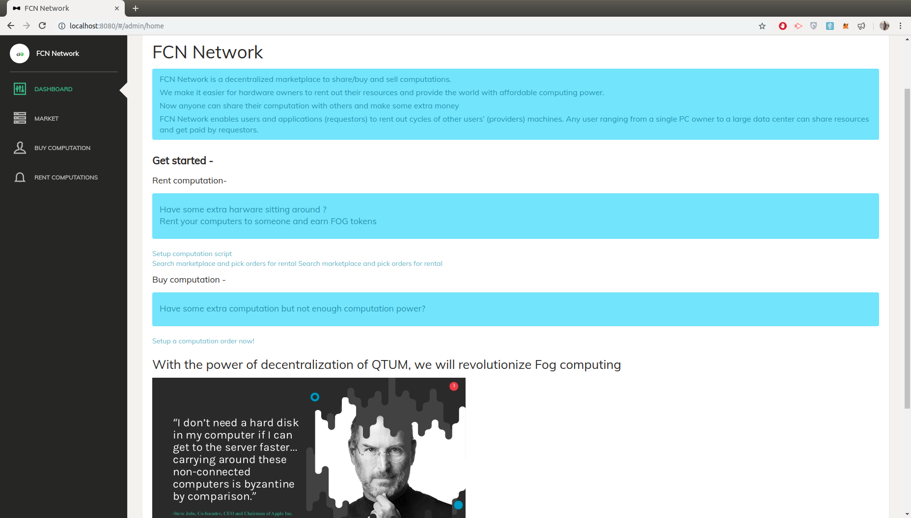
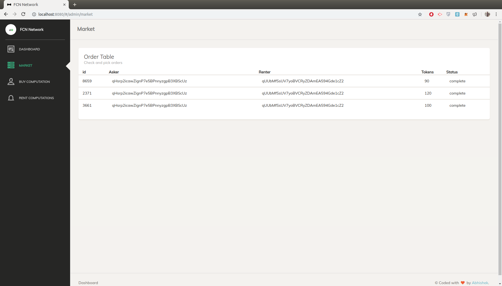
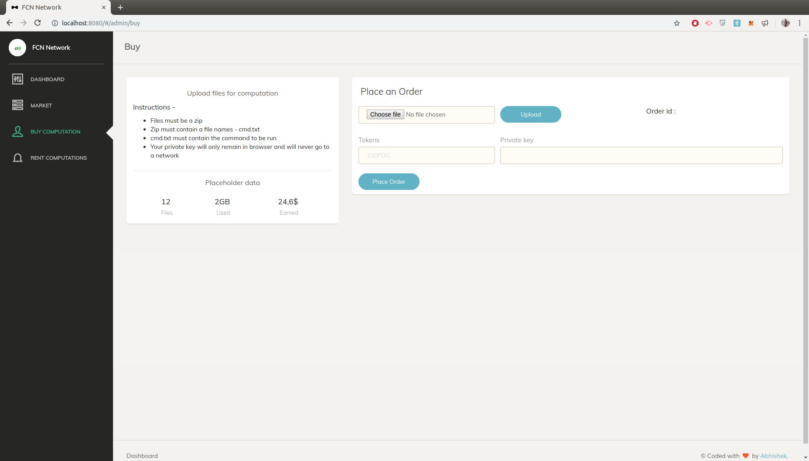
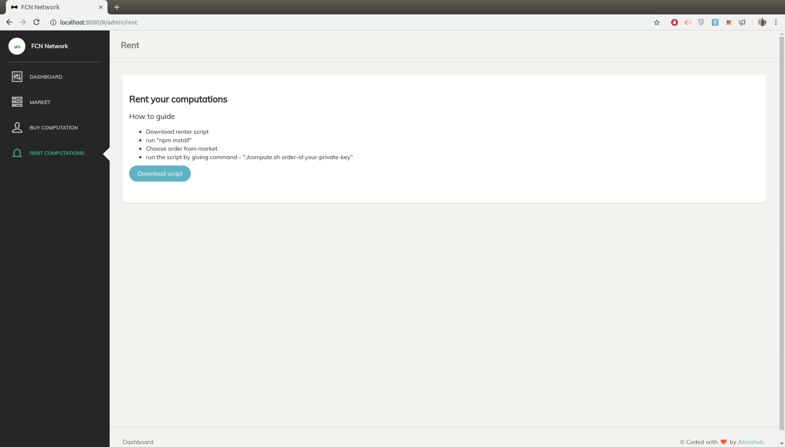

# FCN network
Decentralized marketplace to share/ buy and sell computations. Paving the way to the future of FOG computing.

FCN Network is a decentralized computation sharing marketplace.

We make it easier for hardware owners to rent out their resources and provide the world with affordable computing power.

FCN Network enables users and applications (requestors) to rent out cycles of other users’ (providers) machines. Any user ranging from a single PC owner to a large data center can share resources and get paid by requestors.


### Installation - 
- Deploy smart contract
```
fog.sol
```
- and setup contract address in js files

- Make sure QTUM testnet is connected and running

- Start flask api for file storage(will be replaced by IPFS soon)
```
cd Api
```
then
```
python3 api.py
```
- Start Vue web app
```
cd App/app
```
```
npm install
```
```
npm run dev
```
- Download and unzip bash script
```
cd Scripts
```
```
npm install
```
```
./compute.sh <order-id> <private-key>
```

### Youtube video - 
[FCN Network](http://)

### Screenshot -
 Home

 Market Listings

 buyer board

 seller board

 
### Use cases - 
People can share computing resources to carry out tasks like 
- Machine Learning models
- Big data computation 
- Video and graphics rendering
- Cloud infrastructure for applications
 
### Tech Stack used
- Blockchain - QTUM
- Smart contracts - Solidity
- Backend API for data storage - Python-Flask
- Frontend application- VueJs + Vue-router + QtumJS
- Linux script for computations - Shellscript + NodeJS
